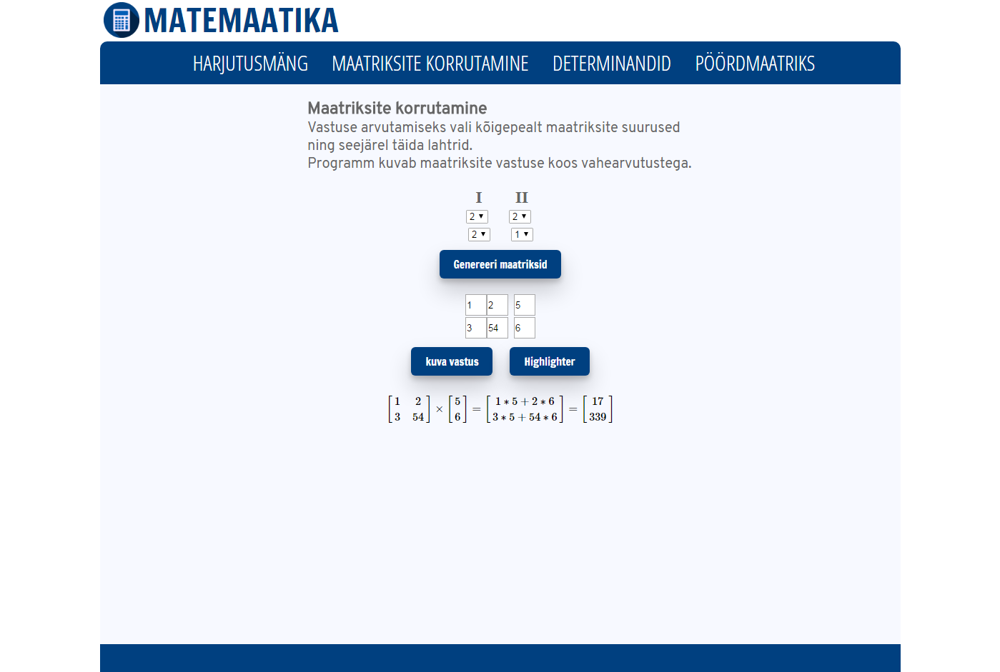

# Maatriksi kalkulator

## Lühikirjeldus
Kliendi soov oli saada mugav ja lihtne maatriksite kalkulaator, mida saaks meiesugused tudengid kasutada. Valida on praegu võimalik kolme erineva maatriksi kalkulaatori vahel: tavaline maatriksite korrutamine, determinantide arvutamine ja pöördmaatriks. Lisaks lahendusele, on võimalik ka näha, kuidas arvutusprotsess käib. See projekt on loodud Tallinna Ülikoolis Digitehnoloogiate instituutis kursuse IFI6213.DT Tarkvaraarenduse praktika raames.

## Liikmed
Johan Laas, Heleri Mändla, Sten-Erik Tool, Karl-Erik Borkmann ja Mattias Blehner.

## Kasutatud tehnoloogiad
MathJax, jQuery raamistik.

## Litsents
Copyright 2017 Ryhm13

Licensed under the Apache License, Version 2.0 (the "License");
you may not use this file except in compliance with the License.
You may obtain a copy of the License at

    http://www.apache.org/licenses/LICENSE-2.0

Unless required by applicable law or agreed to in writing, software
distributed under the License is distributed on an "AS IS" BASIS,
WITHOUT WARRANTIES OR CONDITIONS OF ANY KIND, either express or implied.
See the License for the specific language governing permissions and
limitations under the License.

## Ekraanitõmmis

## Paigaldusjuhend

https://github.com/ciruss/Suvepraktia2017
Sellelt lehelt on võimalik alla laadida kood maatriksite arvutamise veebilehe jaoks. Selleks vajutada nuppu "Clone or download", sellepeale tekib eraldi menüü, kust tuleb vajutada "Download ZIP". Siis tõmbab alla kokkupakitud failid koodist. Edasi tuleks see .zip fail lahti pakkida ning tõsta need failid enda poolt valitud veebiserverisse.
